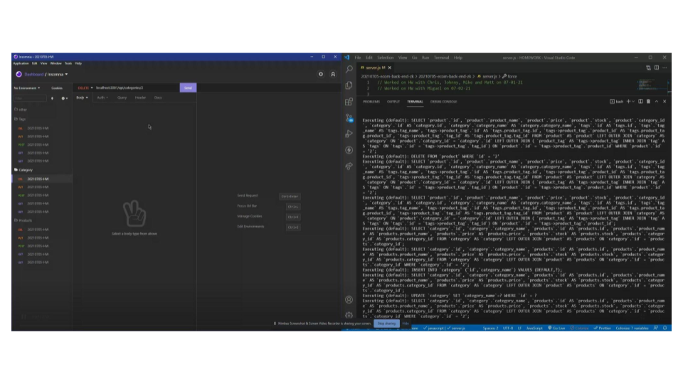

#20210705 e-Commerce Back End


 ## Table of Contents.
 * [Overview](#overview)
 * [Design](#overview)
 * [Installation](#overview)
 * [Usage](#overview)
 * [Criteria](#given-criteria)
 * [Questions](#have-questions)
 * [Links](#links)
 ---


## Overview 
This is a project i was tasked to build the back end for an e-commerce site by modifying starter code. You’ll configure a working Express.js API to use Sequelize to interact with a MySQL database.

## Design


no UI designed, project made to run through insomnia.

## Installation Instructions
Install node and the following with npm install; sequelize, express, dotenv and mysql2.

## Usage Instructions
After installing npms, use node to launch the server.js, then use insomnia to make queries to database.


---
## Given Criteria
WHEN I add my database name, MySQL username, and MySQL password to an environment variable file
THEN I am able to connect to a database using Sequelize


WHEN I enter schema and seed commands
THEN a development database is created and is seeded with test data


WHEN I enter the command to invoke the application
THEN my server is started and the Sequelize models are synced to the MySQL database


WHEN I open API GET routes in Insomnia Core for categories, products, or tags
THEN the data for each of these routes is displayed in a formatted JSON


WHEN I test API POST, PUT, and DELETE routes in Insomnia Core
THEN I am able to successfully create, update, and delete data in my database

---
## Have Questions
### You can contact me at:

GITHUB: <https://github.com/ZacharyWK>

EMAIL: <ZachKrause@live.com>


---
## Links
[REPOSITORY](https://github.com/ZacharyWK/20210705-ecom-back-end-zk)
```
https://github.com/ZacharyWK/20210705-ecom-back-end-zk
```

[WALKTHROUGH](https://youtu.be/Op88OHmGvQU)
```
https://youtu.be/Op88OHmGvQU
```